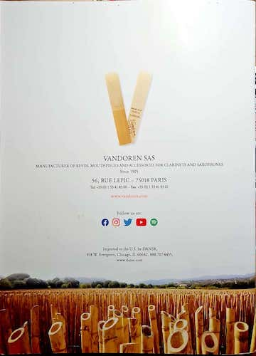

# The Clarinetist Discourse: Improvement Versus Tradition

The story of the clarinet began at the end of the Classical period, the eighteenth century.
In the centuries since its creation, people have improved upon the original clarinet;
they added keys, enlarged parts, and developed key systems (The Editors of Encyclopedia Britannica, n.d.).
All these improvements came together to create the modern clarinet. However, during those centuries,
the practices clarinetists developed to play and maintain the instrument grew less creative, less flexible,
and calcified into modern, classical clarinetist tradition. The discourse of classical clarinetists is
a discourse struggling between the desire to seek improvements and traditions.

One text that participates in the discourse of classical clarinetists is the back of a Vandoren—
a company that sells clarinet accessories—product catalog. Pictured on the back of the catalog are
two Vandoren’s traditional reeds—reeds are one of the parts that make up the clarinet and are traditionally made of cane—
on top of another photo of rows of cut cane. The back of the catalog has text, reading,
“Vandoren SAS: manufacturer of reeds, mouthpieces and accessories for clarinetists and saxophones since 1905” (Vandoren, 2022).
To me, the catalog uses Vandoren’s prominence in the clarinetist discourse as a traditional source of reeds to help market its company.
Vandoren’s traditional reeds are, as their name suggests, their most traditional and well-known line of reeds, so their central placement,
along with the text “since 1905,” reinforces Vandoren’s traditional role as provider of reeds to clarinetists and saxophone players.
The photo of cut cane references the traditional source material of reeds, cane. However, cane isn’t the only source of reeds.
Vandoren also sells plastic reeds—a type of reed that uses plastic instead of cane—a modern invention that rose from the desire to improve
reed life and quality consistency. By aligning themselves with clarinet tradition and the image of the traditional reed, they suppress
the clarinet improvement of the plastic reed. The catalog participates in the struggle between tradition and improvement by
dominating the Discourse of cane reed users over the discourse of plastic reed users.

Another text that participates in the discourse of classical clarinetists is L. Omar Henderson’s post to a discussion board about
bass clarinetist Michael Lowenstern’s bore oil experiment video (Henderson, 2018). Henderson was the owner of Doctor’s Products,
a small company that sells various clarinet products, including plant-based bore oil, an oil used to oil the wooden inside of the clarinet
(Omar Henderson). In his post, he argues against Lowenstern’s findings that bore oil does not penetrate grenadilla wood because
Lowenstern used mineral oil, not plant oil. Here, Henderson defends the clarinetist tradition of oiling bores by challenging
the tradition of using mineral oil. Henderson acknowledges mineral oil’s traditional role as bore oil when he points out that
Lowenstern’s experiment used mineral oil, “which is sold, even by the big 3 instrument manufacturers, as bore oil” (Henderson, 2018).
However, he then argues that “petroleum based oils weaken the cell walls of wood and cork and cause their collapse over time,”
and suggests plant oil as the better bore oil, an improvement for the bore oiling tradition (Henderson, 2018). Henderson’s stance
does not align neatly with either tradition of improvement, but it undeniably participates in the conflict. Lowenstern’s video are
a challenge against the tradition of oiling bore, so by denying the results of Lowenstern’s findings, Henderson aligns himself with
the traditional. However, the way he denied Lowenstern’s findings aligns with improvement—he challenged the traditional (mineral) oil
used for oiling bores. Henderson’s post compromises the desire to seek improvements and to desire to adhere to tradition by seeking
to improve on clarinetist traditions.

Clarinetist Michèle Gingras’s introduction to the 44th “secret” in her *Clarinet Secrets: 52 Performance Strategies for
the Advanced Clarinetist* also participates in the Discourse of clarinetists. In the introduction of the chapter, she argues
for clarinetists learning vibrato, a technique that makes sound sound like it's wavering (Gingras, 2004). Her argument specifically challenges
the Discourse of classical American clarinetists—she points out that British classical clarinetists “tend to use vibrato more consistently than
other schools” (Gingras, 2004, p. 100). Gingras’s arguement for the addition of vibrato in the American clarinetist skill repertoire aligns
with the desire for improvement. She argues that vibrato “can add color and character” to a performance, improving it, and even musicians
that do not want to add vibrato to their regular use would improve their performances by learning vibrato for when
“avant-garde composers specifically call for vibrato in their music” (p. 100). Gingras’s argument aligns with improvement over tradition
by challenging the tradition of avoiding vibrato by positioning vibrato as an improvement for performance. In the struggle between
tradition and improvement, Gingras sides with improvement by encouraging the introduction of vibrato in the discourse of American classical clarinetists. 

The classical clarinetist discourse is characterized by its struggle between traditions and improvements, whether through
equipment, maintenance, or technique. The clarinet was a classical instrument. Over the centuries of the instrument’s existence, its players
have developed practices and techniques, and over those centuries, those practices and techniques aged into traditions. But, the modern clarinet and clarinetist
exists as they are today through breaks from traditions, from improvements on the clarinet’s original form and methods. The classical clarinetist
practice would not be what it is today without its struggle between tradition and improvement; it is defined by the struggle.

# References
Gingras, M. (2004). Secret 44: Vibrato. *Clarinet secrets: 52 performance strategies for the advanced clarinetist*. Scarecrow Press.

Henderson, L. O. \[The Doctor\]. (2018, April 26). *Re: Michael Lowenstern’s bore oil experiment* \[Online forum post\]. Woodwind.org.
[http://test.woodwind.org/clarinet/BBoard/read.html?f=1&i=464691&t=464689](http://test.woodwind.org/clarinet/BBoard/read.html?f=1&i=464691&t=464689)

Omar Henderson. (n.d.). *Home* \[LinkedIn page\]. LinkedIn. Retrieved March 7, 2024, from
[https://www.linkedin.com/in/omar-henderson-6172113a](https://www.linkedin.com/in/omar-henderson-6172113a)

The Editors of Encyclopedia Britannica. (n.d.). Clarinet. In *Encyclopedia Britannica*. https://www.britannica.com/art/clarinet
Vandoren. (2022, September). Vandoren SAS: Manufacturer of reeds, mouthpieces, and accessories for clarinets and saxophones. *Vandoren*, 09/2022 edition.
